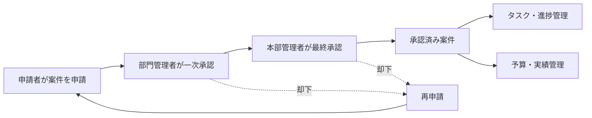
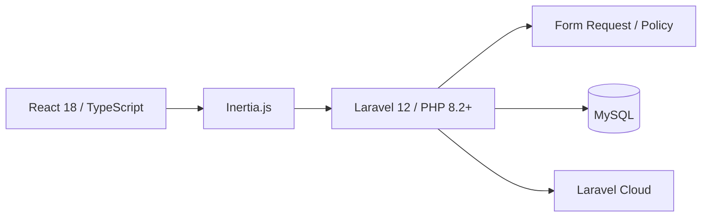

<div align="center">

# ProjNexus

### 

</div>


---

## アプリ名

ProjNexus


---

## 目的

大手企業での手作業での事務負担を軽くするために、
申請業務・開発進捗管理・予算管理を一つの画面にして、業績管理をしやすくする。

経理・管理会計・事業推進で培った業務理解を、
データ設計・ロール別認可・画面設計・実装へ落とし込んだ業務 Web アプリです。

---

## 作成背景　（このアプリで解決したいこと）

これまでの経理・管理会計・事業推進の経験から、情報が複数の帳票やツールに分かれる課題を感じてきました。

情報が分断されると、転記・確認・集約に手間がかかります。  
承認の現在地や、進捗と予算の関係も見えにくくなります。

ProjNexus は、案件データを中心に、申請から承認・タスク・予算までをつなぐことで、関係者が同じ情報から次の行動を判断できる構造を目指しました。

| 分断されていた管理 | 生じる課題 | ProjNexusでの対応 |
|---|---|---|
| 申請システム | 誰の判断待ちか分かりにくい | 2段階承認と承認ステッパー |
| 部門別 Excel | 進捗の再入力・再集約が必要 | 4状態のタスクと3つの表示 |
| 予算管理 Excel | 進捗と予算を別々に確認 | 案件別の予算・実績・消費率 |

> 本作は架空企業の業務シナリオを題材とした PoC です。  
> 実運用による工数削減率などの効果測定は行っていません。

---


## 代表画面

[Live Demo](https://projnexus-main-butvrx.laravel.cloud/login) ｜ [GitHub](https://github.com/toutetu/ProjNexus_continue)


<p align="center">
  
</p>

---

## 業務フロー



- 申請者 → 部門管理者 → 本部管理者の2段階承認
- 却下後は元案件を残し、新しい申請を `parent_project_id` で接続
- 承認後にタスク管理と予算管理を開始
- 部門管理者本人の申請は一次承認を省き、自己承認を防止

---

## 代表画面

| 承認フロー | 予算・実績一覧 |
|---|---|
|  |  |
| 申請から承認済みまでの現在地を表示 | 予算額・実績額・消費率を同じ画面で確認 |

画面キャプチャを含む操作マニュアルは [`materials/manual/user_manual.md`](materials/manual/user_manual.md) にまとめています。

---

## 主な機能

### 1. 申請・承認

- 下書き保存・申請・取り戻し
- 部門管理者と本部管理者による2段階承認
- 承認者・段階・日時・コメントの記録
- 却下後の再申請チェーン
- 部門管理者本人の一次承認を省く自己承認防止
- 承認ステッパーによる現在地の可視化

### 2. タスク・進捗管理

- `open` / `in_progress` / `resolved` / `closed` の4状態
- カンバン / メンバー別 / 一覧の3ビュー
- 担当者と確認者を分ける完了確認工程
- 担当者・期限・進捗などの変更履歴を自動記録
- タスク割当・期限・確認依頼などのアプリ内通知

### 3. 予算・実績管理

- 案件単位の予算額・実績額
- 最新入力値から消費率を都度算出
- 消費率に応じた注意・超過の色分け
- ロールの閲覧範囲に応じた予算一覧

### 4. ダッシュボード

- 稼働案件・承認待ち・平均進捗・予算消費率の KPI
- 部門別の平均進捗
- 予算消費率70%以上の案件抽出

> 月次予算消費推移は現在サンプル値です。  
> 実データからの月次集計は継続改善項目としています。

---

## ロールと権限

| 主な操作 | 申請者 | 部門管理者 | 本部管理者 |
|---|:---:|:---:|:---:|
| 案件の新規申請 | 自分の案件 | 自分の案件 | — |
| 承認・却下 | — | 自部門の一次承認 | 最終承認 |
| 案件の閲覧 | 自分・担当・同部門の承認済み案件 | 自部門 | 全部門 |
| タスク編集 | 担当・確認対象 | 自部門 | 閲覧のみ |
| 予算実績更新 | 担当案件 | 自部門 | 閲覧のみ |

UI の表示・非表示だけに依存せず、Laravel Policy でサーバー側の操作可否を判定します。  
URL の直接入力や、権限外の部門データに対する操作もサーバー側で拒否します。

---

## 設計で重視したこと

### 判断の経緯を残す

承認結果だけでなく、承認者・承認段階・日時・コメントを `approvals` に記録します。  
却下後も元案件を削除せず、再申請との関係を追跡できます。

### 現在値と履歴を分ける

案件の現在状態と、承認・タスク変更の履歴を別テーブルに分けました。  
最新状態を扱いやすくしながら、後から変更経緯を確認できる構造です。

### 入力値と算出値を分ける

予算額と実績額を入力値として保持します。  
消費率は都度算出し、同じ指標を複数箇所へ重複保存することによる不整合を避けます。

### 業務責任を認可ルールへ変換する

「誰が、どのデータに、何を行えるか」をロール・部門・案件状態・担当関係で判定します。  
本部管理者のタスク操作は閲覧専用です。

---

## 技術構成



| 層 | 採用技術 | 主な役割 |
|---|---|---|
| バックエンド | PHP 8.2+ / Laravel 12 | 業務処理・入力検証・認可・通知・履歴 |
| フロントエンド | React 18 / TypeScript | 画面状態・フォーム・表示切替 |
| 接続 | Inertia.js 2 | Laravel のルートと React ページの接続 |
| 認証 | Laravel Breeze | ログイン・パスワード関連機能 |
| 権限 | spatie/laravel-permission / Laravel Policy | 複数ロールと操作権限の判定 |
| UI | Tailwind CSS / Radix UI / lucide-react | デザインと UI コンポーネント |
| グラフ | Recharts | KPI・進捗・予算の可視化 |
| データベース | MySQL | 案件・承認・タスク・予算・履歴 |
| テスト | PHPUnit 11 / Laravel Feature tests | 業務フローと権限境界の検証 |
| デプロイ | Laravel Cloud | 公開環境 |

独立した REST API は設けず、ルーティング → Form Request → Controller / Policy → Eloquent → Inertia の流れで処理しています。

---

## 開発プロセスとAI活用

AIへ判断を任せるのではなく、要件・設計判断・受入基準・最終レビューは本人が担当しました。

| 本人が担うこと | AIに支援させること |
|---|---|
| 課題の解釈・要件・優先順位・スコープ | 仕様の言語化と設計案の比較 |
| DB・認可・UIの設計判断 | 実装案・差分修正・テスト作成の補助 |
| 生成差分のレビュー・テスト・最終責任 | 不具合原因とリファクタリング案の提示 |

初期 PoC では、実装前に主要画面の HTML モックと設計資料を作成しました。  
仕様を正本化し、AI が生成した差分も根拠を確認しながら取り込みました。

---

## ローカル環境構築

### 前提

- PHP 8.2 以上
- Composer
- Node.js / npm
- MySQL

### セットアップ

```bash
# PHP・JavaScript依存パッケージ
composer install
npm install

# 環境設定
cp .env.example .env
php artisan key:generate

# .env の DB_* を設定後
php artisan migrate --seed

# Laravel・キュー・ログ・Viteをまとめて起動
composer run dev
```

Windows PowerShell では、環境設定ファイルのコピーに次を使用できます。

```powershell
Copy-Item .env.example .env
```

XAMPP を使用する場合は、MySQL を起動してから `.env` の `DB_*` を設定してください。

---

## テスト

```bash
php artisan test
```

Feature テストでは、次の業務ルールを中心に検証しています。

- 申請・2段階承認・再申請
- 本部管理者のタスク閲覧専用
- 申請者・部門管理者の部門境界
- タスクのフィルター・更新・変更履歴
- 通知一覧と添付ファイル

---

## 設計資料

| パス | 内容 |
|---|---|
| [`materials/Design/system_spec.md`](materials/Design/system_spec.md) | システム仕様の正本 |
| [`materials/Design/er_diagram.md`](materials/Design/er_diagram.md) | ER図・テーブル・Enum |
| [`materials/Design/screen_flow.md`](materials/Design/screen_flow.md) | 画面一覧・URL・遷移 |
| [`materials/Design/components_spec.md`](materials/Design/components_spec.md) | UIコンポーネント仕様 |
| [`materials/Design/design_system.md`](materials/Design/design_system.md) | デザイントークン・カラー定義 |
| [`materials/quest/requirements.md`](materials/quest/requirements.md) | 要件定義と実装状況 |
| [`materials/manual/user_manual.md`](materials/manual/user_manual.md) | 画面付き利用マニュアル |
| [`doc/Information.md`](doc/Information.md) | 公開環境・動作確認情報 |

---

## 現在の到達点と今後

### 実装済み

- 申請・2段階承認・再申請
- 3ロールのサーバー側認可
- 4状態・3ビューのタスク管理
- 予算・実績・消費率管理
- アプリ内通知・変更履歴
- KPI・部門進捗・予算注意案件のダッシュボード
- Laravel Cloud へのデプロイ

### 継続改善

- 月次予算推移の実データ集計
- 予算の支出明細管理
- メール通知とキュー運用の強化
- ユーザー・部門マスタ管理
- PC・タブレット・スマートフォンの導線最適化
- Feature テストの拡充

---

## 制作情報

| 項目 | 内容 |
|---|---|
| 開発形態 | 個人開発 |
| 担当 | 要件整理 / DB設計 / UI設計 / 実装 / テスト / デプロイ |
| 初期開発期間 | 2026-04-13 〜 2026-05-15 |
| 初期スコープ | 100時間枠の PoC |
| 現在 | 初期提出後も継続改善中 |

本作は、採用課題で提示された架空企業の業務シナリオを題材に開発しました。  
企業固有の提出情報ではなく、業務課題をデータ・権限・画面へ落とし込む設計判断を中心に掲載しています。
