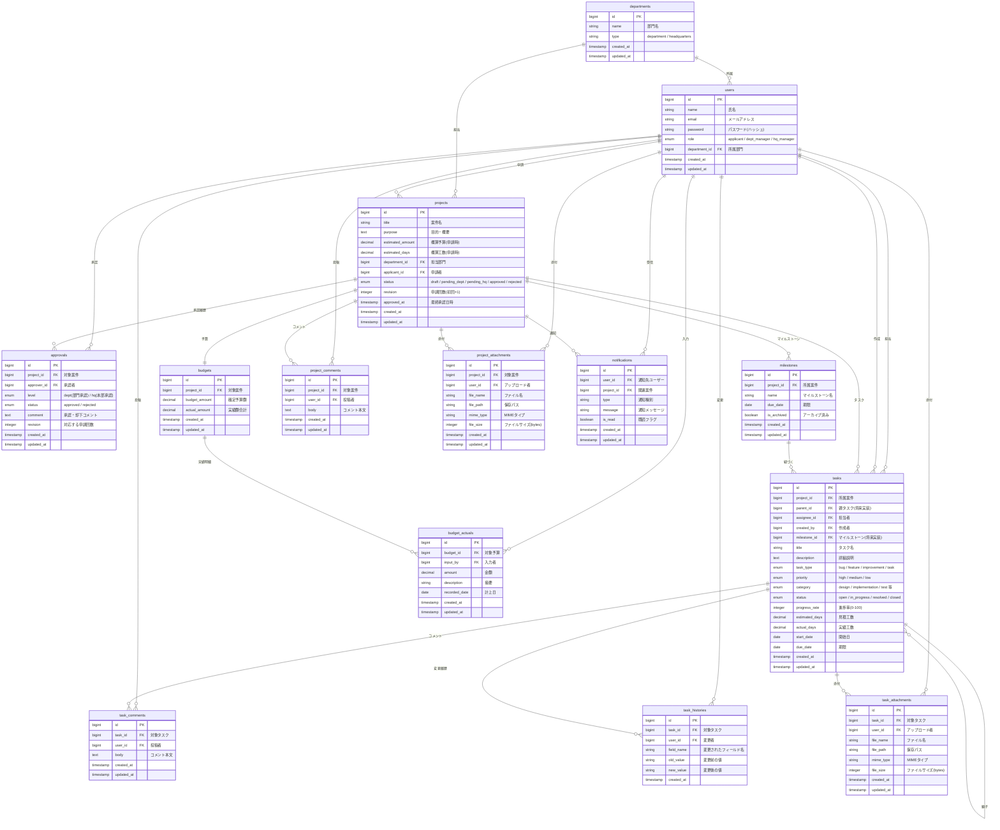

# ER図（v4 統合版） - 開発管理統合アプリケーション

## テーブル一覧（14テーブル）

| # | テーブル名 | 説明 | PoC実装 |
|---|--------|------|--------|
| 1 | departments | 部門 | ○ |
| 2 | users | ユーザー | ○ |
| 3 | projects | 案件 | ○ |
| 4 | approvals | 承認履歴 | ○ |
| 5 | milestones | マイルストーン | テーブルのみ |
| 6 | tasks | タスク（Backlog風） | ○ |
| 7 | budgets | 予算 | ○ |
| 8 | budget_actuals | 予算実績明細 | ○ |
| 9 | task_comments | タスクコメント | ○ |
| 10 | task_histories | タスク変更履歴 | ○ |
| 11 | task_attachments | タスク添付ファイル | テーブルのみ |
| 12 | project_comments | 案件コメント | テーブルのみ |
| 13 | project_attachments | 案件添付ファイル | テーブルのみ |
| 14 | notifications | 通知 | ○ |

## 設計思想

### 監査証跡を重視した承認管理

承認の記録は projects テーブルのタイムスタンプではなく、独立した approvals テーブルで管理する。これにより「誰が・いつ・どのレベルで・どんな判断をしたか」をレコード単位で追跡できる。却下→再申請のケースでは、projects.revision と approvals.revision の組み合わせで「第何回目の申請に対する承認か」が明確になり、承認プロセスの透明性を確保する。

### 予算の総額と明細を分離

案件の予算管理は budgets（総額）と budget_actuals（実績明細）に分離する。申請時の概算予算は projects.estimated_amount に記録し、承認後の確定予算は budgets.budget_amount で管理する。実績は budget_actuals に個別の計上日・摘要付きで記録するため、消費率の推移や支出内訳の分析が可能になる。

### PoCはシンプルに、将来拡張に備える

タスク担当は assignee_id による単一担当とし、PoCの実装負荷を抑える。親子タスク（parent_id）、マイルストーン（milestone_id）、ファイル添付（task_attachments / project_attachments）は、テーブル定義とリレーションのみ用意し、画面実装は卒業後のポートフォリオ開発で段階的に進める。将来的には task_users 中間テーブルの導入による多対多担当、ガントチャート、カンバン表示などに拡張する。

### Backlog風のタスク管理

タスクは種別（bug / feature / improvement / task）、優先度（high / medium / low）、カテゴリ（design / implementation / test 等）の3軸で分類し、ステータスは open → in_progress → resolved → closed の4段階で管理する。コメント（task_comments）と変更履歴（task_histories）により、Backlogのような課題管理のやり取りと変更追跡を実現する。

### 部門区別は文字列型で柔軟に

departments.type を string 型とし、現時点では department / headquarters の2値で運用する。boolean の is_headquarters と比べて、将来「子会社」「グループ会社」等の区分を追加する際にマイグレーション不要で対応できる。

## ER図



---

## ステータス・区分値一覧

### projects.status
| 値 | 説明 |
|---|---|
| draft | 下書き |
| pending_dept | 部門承認待ち |
| pending_hq | 本部承認待ち |
| approved | 承認済み・開発中 |
| rejected | 却下（履歴として保持） |

### departments.type
| 値 | 説明 |
|---|---|
| department | 一般部門 |
| headquarters | 本部 |

### users.role
| 値 | 説明 |
|---|---|
| applicant | 申請者（各部門の案件担当者） |
| dept_manager | 部門管理者 |
| hq_manager | 本部管理者 |

### tasks.task_type
| 値 | 説明 |
|---|---|
| task | タスク（デフォルト） |
| bug | バグ |
| feature | 機能追加 |
| improvement | 改善 |

### tasks.priority
| 値 | 説明 |
|---|---|
| high | 高 |
| medium | 中（デフォルト） |
| low | 低 |

### tasks.status
| 値 | 説明 |
|---|---|
| open | 未着手 |
| in_progress | 進行中 |
| resolved | 解決済み |
| closed | 完了 |

### tasks.category
| 値 | 説明 |
|---|---|
| design | 設計 |
| implementation | 実装 |
| test | テスト |
| documentation | ドキュメント |
| other | その他 |

### approvals.level
| 値 | 説明 |
|---|---|
| dept | 部門承認（一次承認） |
| hq | 本部承認（最終承認） |

### notifications.type
| 値 | 説明 |
|---|---|
| dept_approval_needed | 部門承認依頼 |
| hq_approval_needed | 本部承認依頼 |
| approved | 承認完了 |
| rejected | 却下 |
| task_due_soon | タスク期限間近 |
| budget_alert | 予算アラート |

---

## ロールとデータアクセス範囲

| ロール | 説明 | データアクセス範囲 |
|--------|------|----------------|
| applicant | 申請者 | 自身の案件・タスクのみ |
| dept_manager | 部門管理者 | 自部門の全案件・タスク |
| hq_manager | 本部管理者 | 全部門の全案件・タスク |

## 承認フロー

```
申請者(draft) → 部門管理者(pending_dept) → 本部管理者(pending_hq) → 承認(approved)
                     ↓ 却下                        ↓ 却下
                  rejected                       rejected
                  (申請者が revision+1 で再申請)
```

## 予算管理

- `projects.estimated_amount`: 申請時の概算予算
- `budgets.budget_amount`: 承認後の確定予算額
- `budget_actuals`: 実績の明細（個別入力）
- `budgets.actual_amount`: 実績額合計（budget_actualsの集計値）
- 消費率: `budgets.actual_amount / budgets.budget_amount × 100` で算出

## インターン中・卒業後の実装区分

### インターン100時間で実装
- 全14テーブルのマイグレーション・モデル定義
- 認証・ユーザー管理（Breeze）
- 承認フロー（申請・一次承認・最終承認 + approvals記録）
- タスク管理（一覧・基本CRUD・進捗管理）
- 予算管理（budgets + budget_actuals・消費率）
- ダッシュボード（ロール別・進捗/予算可視化）
- 通知機能（アプリ内通知）

### 卒業後のポートフォリオとして拡張
- 親子タスクのUI（ツリー表示）
- マイルストーン管理画面
- ガントチャート
- タスク添付ファイル機能
- 案件コメント・添付ファイル機能
- Backlog風UIの完成度向上（カンバン等）