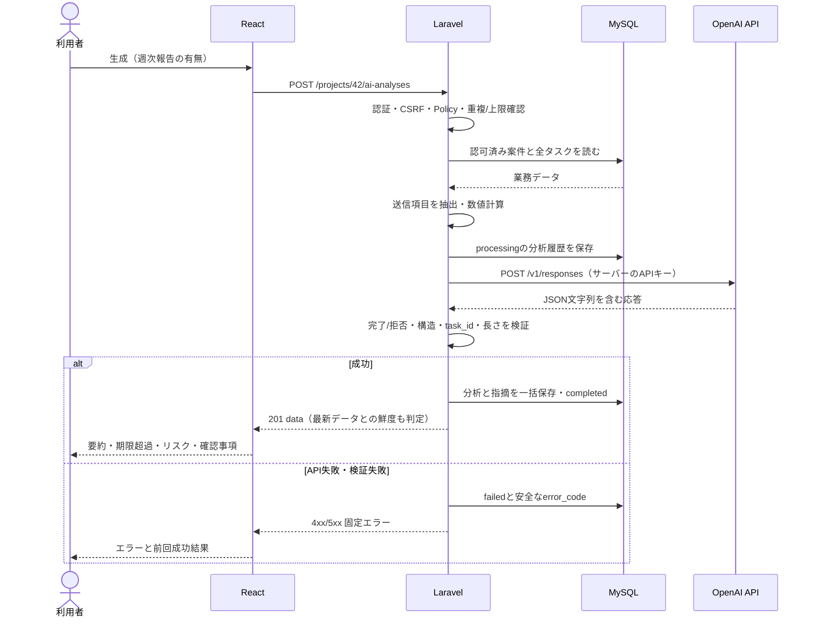

# 03 送受信JSON・API契約 — レビュー案 v0.1

状態: 未実装 / 2026-09-14。以下のURL・クラス・環境変数は追加予定であり、現在のアプリで呼び出せるものではない。
JSON例はすべて架空データ。APIキーや実際の通信記録は含まない。

## 1. 2つの通信と責務



ページ描画・ログインは既存のInertiaとwebセッションを継続する。
生成操作のみ、`routes/web.php` の `auth, verified` グループ内に同一オリジンのJSONエンドポイントを追加する案。
これは既存設計の「Inertiaレスポンスを使う」方針への局所的な追加提案であり、独立した公開REST APIやSanctumのトークン認証は導入しない。
実装時に `system_spec.md` のURL/通信方針も更新する。

## 2. React → Laravel

```http
POST /projects/42/ai-analyses
Content-Type: application/json
Accept: application/json
X-XSRF-TOKEN: <既存のCSRF機構で付く値>
Cookie: <ログインセッション>
```

本文は [browser-request.json](examples/browser-request.json)。

```json
{
  "request_id": "7bc4a7c3-5522-4e19-b1bd-9b8686f4e290",
  "include_weekly_report": true
}
```

| 項目 | 型 | 検証 |
|---|---|---|
| URLのproject | 整数ID | Route Model Binding、存在確認、Policy |
| request_id | UUID文字列 | 必須。1つの論理的な生成操作につき1個 |
| include_weekly_report | boolean | 必須。UI初期値false |
| その他の本文キー | 許可しない | 任意prompt、model、tasks、user_id等を422で拒否 |

ブラウザは業務データやAPIキーを送らない。モデルや料金に影響する上限もサーバー設定で決める。
既存axiosの同一オリジン・CSRF設定を使用する。例のヘッダー値をハードコードしない。
このJSONレスポンスにInertia routerを直接使わず、axiosで取得してカードの状態を更新する。

### 二重送信と再確認

- 同一request_id・同一ユーザー・同一案件・同一オプションの再送は、外部APIをもう一度呼ばない。
- completedなら同じ結果を200で返す。元データが変わっていれば同じ結果に `isStale=true` を付ける。
- processingなら409 `AI_PROCESSING`。120秒を超えた中断記録は回収ルールに従う。
- failedなら保存したerror_codeに対応する同じHTTPエラーを返す。「再生成」は新しいUUIDにする。
- 同一request_idを別ユーザー・案件・オプションに使った場合は409 `AI_REQUEST_CONFLICT`。他者の結果を返さない。
- ブラウザだけがタイムアウトしてサーバーの結果が不明な場合は、同じUUIDで「結果を確認」する。UIは結果不明の間、無条件に新しい生成を繰り返さない。
- request_idの照会は新規生成枠に数えない。認証・Policyは照会でも毎回必要。
- 保存済み操作の照会は、新規生成の設定・現在データの件数/サイズ検証より先に行う。機能停止やタスク削除後も、閲覧権限がある過去の成功結果は取得できる。
- 案件単位のロックで、異なるUUID・別ユーザーによる同時生成も409 `AI_BUSY` とする。

この制御はアプリ側の重複を抑えるものであり、ネットワーク障害時に外部APIで処理されたかを完全に保証する仕組みではない。

## 3. Laravelが組み立てる送信元JSON

完全な例: [llm-input.json](examples/llm-input.json)。

| JSON部分 | 元データ/目的 |
|---|---|
| schema_version | 入力構造の版。初期値1 |
| as_of_date / timezone | Laravelで決めた分析基準日・タイムゾーン |
| project | title、status、budget_amount、actual_amountのみ |
| tasks | 当該案件の全タスクをID昇順。ID、title、種類、優先度、状態、進捗、工数、日付、更新日時 |
| assignee_assigned / reviewer_assigned | ユーザーIDをbooleanへ変換し、氏名等を除外 |
| is_overdue / overdue_days等 | Laravelで計算した事実 |
| metrics | 件数、完了率、期限超過ID、予算消化率 |

金額・工数のDECIMAL値は `"850000.00"` のような小数点以下2桁の文字列、件数/進捗率/超過日数は整数、割合は数値、未設定はnull。
金額演算は浮動小数の誤差を避ける方法で行い、必要な表示率のみ丸める。
日付は `YYYY-MM-DD`、時刻はUTCのISO 8601。表示時にJSTへ変換する。

```json
{
  "task_count": 4,
  "closed_task_count": 1,
  "completion_rate": 25,
  "overdue_task_ids": [202, 203],
  "budget_consumption_rate": 85
}
```

上記の数値と期限超過一覧はLaravelが決める。LLMに件数や超過IDを確定させない。
全文の目的・概要・タスク本文・コメント・添付は送信しない。入力は100タスクかつ64 KiB以内でなければ拒否し、切り詰めた分析を成功として返さない。

## 4. Laravel → OpenAI Responses API

初期候補は `gpt-4.1-mini`。Responses APIとStructured Outputsへの対応を公式資料で確認済み。
最新モデルであるという意味ではなく、短い同期分析を試すための候補である。アカウントでの利用可否・日本語品質・実際の遅延は未検証。[モデル仕様](https://developers.openai.com/api/docs/models/gpt-4.1-mini)

```http
POST https://api.openai.com/v1/responses
Authorization: Bearer <サーバーのOPENAI_API_KEY>
Content-Type: application/json
```

完全なリクエスト本文: [openai-request.json](examples/openai-request.json)。
`input[0].content` は `{ "source": 送信元JSON, "options": { "include_weekly_report": true } }` をJSON文字列化した値。
読みやすいsourceは別ファイルに分けているが、実リクエストの本文にも省略せず含めている。

| 項目 | この案の値 | 目的 |
|---|---|---|
| model | サーバー設定値 | 画面から任意モデルを選ばせない |
| instructions | 固定の日本語指示 | 業務データと命令の区別、根拠、出力ルール |
| input | 上記sourceと週次オプション | 案件ID・ユーザーID・request_id・認証情報は含めない |
| store | false | 後のAPI取得用のレスポンス保存を無効にする |
| stream | false | 完了結果を検証してから表示する |
| max_output_tokens | 4096 | 出力の上限 |
| text.format.type | json_schema | 構造化出力 |
| text.format.name / strict | project_analysis_v1 / true | 出力契約を指定 |
| text.format.schema | 同梱schema | summary・risks・next_checks・weekly_report |

Responses APIでは `text.format` にJSON Schemaを指定する。必須キーは常に返させ、任意の値はnullを許可する。
これで型や形を制約できるが、本文の事実性を保証するものではない。[Structured Outputs](https://developers.openai.com/api/docs/guides/structured-outputs)

`store:false` は提供元のあらゆる保存がゼロになる意味ではない。提供元のデータ管理・不正利用監視の扱いは別に確認する。[データ管理](https://developers.openai.com/api/docs/guides/your-data)

### 設定候補（キーの値は資料やGitHubに書かない）

```dotenv
AI_ANALYSIS_ENABLED=false
OPENAI_API_KEY=
OPENAI_MODEL=gpt-4.1-mini
```

タイムアウト・出力上限・回数制限はconfigで管理する。`env()` はconfig内で使い、クライアントは `config()` を読む。
初期実装の宛先はOpenAI公式HTTPS固定。ユーザー入力からURLを作らず、認証ヘッダー付きのリダイレクトを追わない。
Laravel HTTP Clientを使う案とし、外部通信を `ProjectAnalysisClient` インターフェースの背後に置く。新しいLLM SDK依存は不要。

## 5. OpenAI → Laravel

応答の関連フィールド抜粋: [openai-response.json](examples/openai-response.json)。
その `output[*].content[*].text` を解析したJSON: [llm-output.json](examples/llm-output.json)。
Schema: [llm-output.schema.json](schemas/llm-output.schema.json)。

外側のHTTP応答と、中にあるAI生成JSONは別の構造である。
`output` の順序を固定と仮定せず、messageのcontentからoutput_textを探す。refusalやincompleteは成功扱いしない。[Responses API](https://developers.openai.com/api/reference/cli/resources/responses/methods/create)

### AI生成JSONの契約

| フィールド | 型 | サーバーで検証する上限/条件 |
|---|---|---|
| summary | string | 1〜600文字 |
| risks | array | 0〜5件 |
| next_checks | array | 0〜5件 |
| weekly_report | string または null | ONなら1〜1500文字、OFFならnull |
| 各項目のtask_id | integer または null | 送信元タスクに存在するID。一般的な事項はnull |
| risksのseverity | low / medium / high | 必須。次の確認事項には付けない |
| title | string | 1〜200文字 |
| detail / evidence / recommended_action | string | それぞれ1〜800文字 |

全オブジェクトで追加キーを禁止する。空配列は「入力から特定できなかった」を意味し、リスクが絶対にない保証ではない。
重要度は「high: 早急に確認すべき影響の可能性」「medium: 近い時期に確認が必要」「low: 継続して確認する事項」の3段階。LLMが根拠とともに提案し、業務上の確定判定や発生確率には読み替えない。
Schemaは基本型・required・additionalPropertiesを定義し、文字数・件数・案件所属・週次オプションとの一致はLaravelでも検証する。
不正な項目だけ黙って消して成功にするのではなく、応答全体を失敗として記録する。
1件に複数タスクが関係する場合は主なtask_id1個またはnullとし、根拠の文章で説明する。

処理順:

1. HTTPステータスを分類する。
2. 外側のJSONを解析し、`status=completed` を確認する。
3. refusalが含まれれば中止する。空出力や不完全出力も中止する。
4. output_textの文字列をJSONとして解析する。今回の契約は1つのJSONオブジェクトとする。
5. Schema相当の型・追加キー・長さ・件数・参照IDを検証する。
6. Laravelで作った期限超過指摘を付加し、成功結果を保存する。
7. provider_response_id、input_tokens、output_tokens、処理時間を監査用に記録する。取得できない使用量はnullとし、0や推測値を埋めない。

タスクが外部通信中に削除された場合、入力にあったIDは有効な生成根拠として扱うが、保存時には存在/所属を再確認しFKをnullにする。指摘の文章とスナップショットは保持し、結果は古いと表示する。
未知のIDを最初からLLMが返した場合とは区別する。

## 6. Laravel → React

新規成功は `201 Created`、同じrequest_idの成功結果再取得は `200 OK`。
完全な例: [browser-response.json](examples/browser-response.json)。

| プロパティ | 意味 |
|---|---|
| data.id / projectId / requestId | Laravelで保存した分析の識別子 |
| data.status | 成功レスポンスはcompleted |
| summary | 検証済み要約 |
| delayedItems | Laravelの期限超過指摘。全件。UIに「システム判定」 |
| risks / nextChecks | 検証済みLLM指摘 |
| weeklyReport / includeWeeklyReport | nullまたは報告下書き、生成時のオプション |
| asOfDate / generatedAt | 分析基準日 / 成功日時 |
| isStale | 読取時点で元データまたは基準日が変わったか |
| model | 生成時の設定モデル名。画面では補助情報扱い |
| sourceMetrics | 分析時点の数値。現在の画面サマリーとは別時点になり得る |

各指摘は `id, taskId, title, detail, evidence, severity, recommendedAction` を持つ。
severityはriskのみ必須、それ以外null。recommendedActionはrisk/nextCheckのみ必須、delayはnull。
JSON配列からkindを決め、DBの子行へ変換する。クライアントの表示はcamelCase、外部入力/DBはsnake_caseに統一し、Resourceが変換する。

画面初期描画は `GET /projects/{project}?detailTab=tasks` のInertia propsに最新成功結果と可否を追加する案:

```json
{
  "initialAiAnalysis": null,
  "aiGeneration": {
    "allowed": true,
    "unavailableReason": null
  }
}
```

unavailableReasonは `forbidden | not_approved | not_configured | no_tasks | input_too_large | null`。
allowedは「今回生成可能か」。キーや内部の設定値は送らない。権限があっても0件/未設定ではfalseにする。
最新結果取得だけではLLMを呼ばない。画面再読込・生成完了・結果確認で鮮度を計算し、リアルタイムの自動監視はしない。

## 7. エラー契約

例: [error-response.json](examples/error-response.json)。

```json
{
  "message": "AIサービスからの応答が時間内に届きませんでした。前回の分析結果は保持されています。",
  "errorCode": "AI_TIMEOUT",
  "requestId": "7bc4a7c3-5522-4e19-b1bd-9b8686f4e290",
  "retryAfterSeconds": null
}
```

messageはアプリで決めた日本語文言。生のプロバイダー本文・例外・APIキーを使わない。
requestIdは検証済みUUIDがある場合のみ返し、それ以外null。通常の入力検証では任意で `errors`（フィールド別文字列配列）も返す。

| HTTP | errorCode | UIの案内 |
|---:|---|---|
| 401 | UNAUTHENTICATED | ログインを案内 |
| 403 | FORBIDDEN | 生成不可。未承認もこの分類 |
| 404 | NOT_FOUND | 案件が存在しない |
| 419 | SESSION_EXPIRED | ページを再読み込みして操作 |
| 422 | VALIDATION_ERROR / AI_NO_TASKS / AI_INPUT_TOO_LARGE | 入力条件を案内 |
| 409 | AI_PROCESSING | 同一操作を処理中。後で結果を確認 |
| 409 | AI_BUSY | 別の操作が当該案件を処理中 |
| 409 | AI_REQUEST_CONFLICT | 別操作に使われたrequest_id。結果を返さない |
| 429 | AI_RATE_LIMITED | アプリ側回数制限。Retry-Afterを表示 |
| 429 | AI_PROVIDER_RATE_LIMITED | 提供元の一時的な制限。自動再試行しない |
| 503 | AI_NOT_CONFIGURED / AI_UNAVAILABLE | 未設定、キー/モデルの利用不可、提供元の一時障害 |
| 504 | AI_TIMEOUT | 通信待ち時間超過 |
| 422 | AI_REFUSED | 入力に対し生成不可。生の拒否文は表示しない |
| 502 | AI_INVALID_RESPONSE / AI_INCOMPLETE_RESPONSE | 応答を採用できない。前回結果を保持 |
| 500 | AI_INTERRUPTED / AI_PERSISTENCE_FAILED | 中断または保存失敗。結果確認や再生成を案内 |

Laravelの認証/CSRF/バリデーション/ThrottleはControllerより前に失敗することもある。
生成エンドポイントではJSON用の例外変換で上記へそろえる案とし、React側でも予期しないHTMLやネットワーク切断を一般エラーとして扱う。
提供元の429のうち利用枠・課金設定に起因して短時間では回復しないものは `AI_UNAVAILABLE` とし、「しばらく待てば必ず成功」と案内しない。
Retry-After不明はnull。推測秒数を表示しない。

## 8. 保存・鮮度と後続のクラス設計

`source_hash` は送信元JSONの決まった形式をSHA-256へ変換する。
キー順を固定、タスクをID昇順、DECIMALを固定桁、日時をUTCにそろえる。
基準日は含める。毎回変わる生成時刻・request_id・週次オプションは含めない。
プロジェクトのupdated_atだけではタスク更新を捉えられないため使わない。
詳細は [DB設計](04-database-design.md)。

次の実装設計で具体化する境界:

| クラス/部品候補 | 責務 |
|---|---|
| GenerateProjectAiAnalysisRequest / ProjectPolicy | 入力と権限 |
| ProjectAnalysisContextBuilder | DB → 最小入力、ルール計算、hash |
| ProjectAnalysisClient / OpenAiProjectAnalysisClient | 外部HTTP・応答解析 |
| ProjectAiAnalysisService | 重複、回数、状態遷移、検証、保存 |
| ProjectAiAnalysisResource | DB → 画面JSON、鮮度 |
| ProjectAiAnalysisController | 上記の呼出とHTTP応答 |
| ProjectAiAnalysisCard / API関数 / TypeScript型 | 状態表示・生成操作・契約に沿った描画 |

上記は責務の候補であり、Laravel/Reactの完全なクラス設計は手順6・7で確定する。
