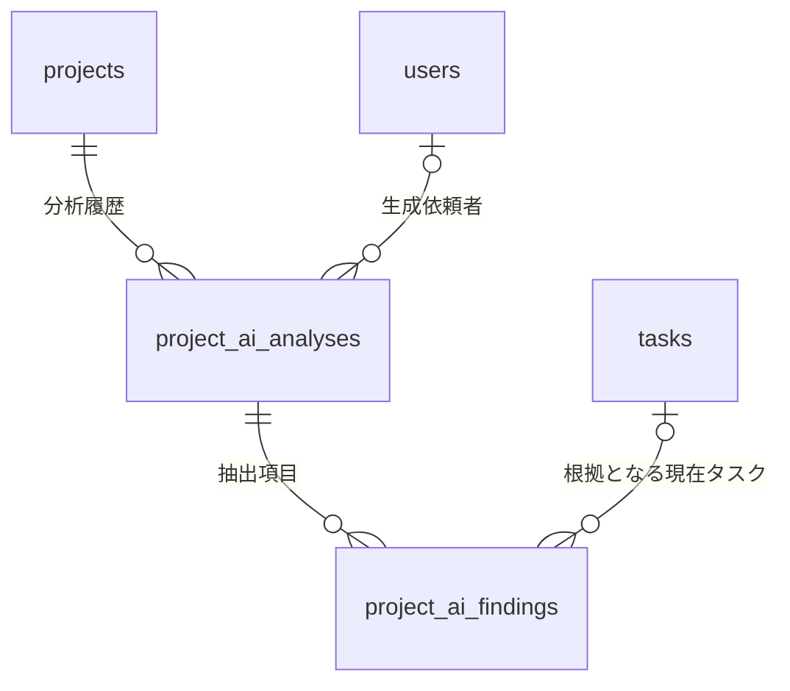
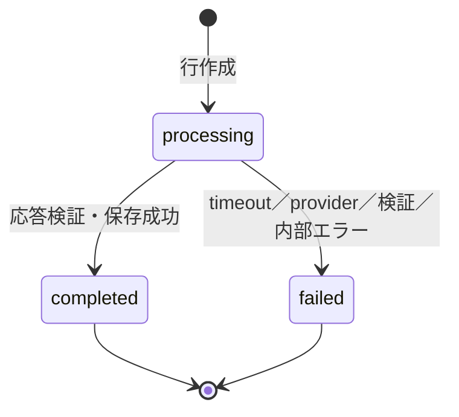

# 04. DB・データ設計 — プロジェクト進捗AI要約

> **状態: 未実装の設計案（レビュー用）**
> 本書は、今後追加する「プロジェクト進捗のAI要約＋リスク抽出」のDB設計を定義する。現時点のmigration・Modelには、ここで述べる2テーブルやEnumは存在しない。実装時は新規migrationを追加し、既存migrationは編集しない。

## 1. 設計の目的

AI生成を単発の画面表示で終わらせず、次の情報を追跡可能な形で保存する。

- 誰が、どの案件について、どの時点のデータで生成したか
- 生成処理が処理中・成功・失敗のどの状態か
- どのprovider・model・prompt・出力schemaを使ったか
- 要約、週次報告文、遅延・リスク・次の確認事項
- レスポンスID、token数、処理時間などの運用メタデータ
- 再送時の二重実行を防ぐクライアント生成UUID

現在値の正本は引き続き `projects` と `tasks` とする。AI分析は、生成時点の入力スナップショットと、その入力から得た派生結果であり、現在値を更新するための正本ではない。

## 2. 既存テーブルとの接続

既存実装で、`projects.id`、`tasks.id`、`users.id` はいずれも `UNSIGNED BIGINT` である。Eloquent上のタスクModel名は `ProjectWorkItem` だが、物理テーブル名は `tasks` である。



削除規則は次のとおりとする。

| 親 | 子FK | 削除時 | 理由 |
|---|---|---|---|
| `projects` | `project_ai_analyses.project_id` | `CASCADE` | 案件に従属する派生データであり、案件削除後に単独保持しない |
| `users` | `project_ai_analyses.requested_by_user_id` | `SET NULL` | 依頼者参照だけを理由に分析を削除しない |
| `project_ai_analyses` | `project_ai_findings.project_ai_analysis_id` | `CASCADE` | 親分析がなければ子の意味がない |
| `tasks` | `project_ai_findings.task_id` | `SET NULL` | タスク削除後も、生成時点の指摘文と根拠文を履歴として残す |

`task_id` を保存する際は、参照先タスクが親分析の `project_id` に属することをLaravel側で必ず検証する。子テーブルへ `project_id` を重複保持しないため、単純なFKだけではこの案件所属制約を表現できない。

`requested_by_user_id` 単独の削除規則は `SET NULL` だが、「ユーザー削除後も分析が必ず残る」という意味ではない。既存の `projects.applicant_id -> users.id` は `ON DELETE CASCADE` のため、削除ユーザーが案件申請者なら案件自体が削除され、その経路で分析もcascade削除される。

## 3. `project_ai_analyses`（親）

1回の生成要求、入力スナップショット、処理状態、生成結果の本文を1行で表す。

| カラム | MySQL想定型 | NULL | default / 制約 | 用途 |
|---|---|:---:|---|---|
| `id` | `BIGINT UNSIGNED` | NO | PK, auto increment | 内部ID |
| `project_id` | `BIGINT UNSIGNED` | NO | FK `projects.id`, `ON DELETE CASCADE` | 分析対象案件 |
| `requested_by_user_id` | `BIGINT UNSIGNED` | YES | FK `users.id`, `ON DELETE SET NULL` | 生成を依頼したユーザー |
| `request_id` | `CHAR(36)` | NO | globally unique | クライアント生成UUID。冪等性キー |
| `status` | `VARCHAR(20)` | NO | default `processing` | `processing / completed / failed` |
| `include_weekly_report` | `BOOLEAN` | NO | default `false` | 週次報告文も生成する要求か |
| `source_snapshot` | `JSON` | NO | — | LLMへ渡したホワイトリスト業務データと決定論的メトリクス |
| `source_hash` | `CHAR(64)` | NO | lowercase SHA-256 | 現在データに対する分析結果の鮮度判定。uniqueにはしない |
| `provider` | `VARCHAR(32)` | NO | default `openai` | 実際に呼び出したprovider |
| `model` | `VARCHAR(100)` | NO | — | 実行時に設定から解決したmodel名 |
| `prompt_version` | `VARCHAR(32)` | NO | — | 使用したprompt仕様の版 |
| `schema_version` | `VARCHAR(32)` | NO | — | 構造化出力schemaの版 |
| `summary` | `TEXT` | YES | — | 現在の進捗要約。成功時は空文字不可 |
| `weekly_report` | `TEXT` | YES | — | 週次報告文。要求しない場合は常にNULL |
| `provider_response_id` | `VARCHAR(255)` | YES | — | providerが返した追跡用レスポンスID |
| `input_tokens` | `INT UNSIGNED` | YES | — | providerが返した入力token数 |
| `output_tokens` | `INT UNSIGNED` | YES | — | providerが返した出力token数 |
| `latency_ms` | `INT UNSIGNED` | YES | — | 外部API呼び出しの経過ミリ秒 |
| `error_code` | `VARCHAR(64)` | YES | — | 公開可能な固定分類だけを保存 |
| `started_at` | `TIMESTAMP` | NO | — | API処理を開始した時刻。`processing` 行作成時に必ず設定 |
| `completed_at` | `TIMESTAMP` | YES | — | `completed` または `failed` に確定した時刻 |
| `created_at` | `TIMESTAMP` | YES | Laravel timestamps | 行作成時刻 |
| `updated_at` | `TIMESTAMP` | YES | Laravel timestamps | 状態確定時刻の追跡 |

### 3.1 Index

| Index | 種別 | 用途 |
|---|---|---|
| `request_id` (`paia_request_id_unique`) | UNIQUE | UUIDのグローバル重複をDBでも防止 |
| (`project_id`, `status`, `completed_at`) (`paia_project_status_completed_idx`) | INDEX | 案件ごとの最新成功結果を取得 |
| (`status`, `started_at`) (`paia_status_started_idx`) | INDEX | 長時間 `processing` の回収 |

`source_hash` は同じ入力から意図的に再生成できるためuniqueにしない。MVPでは最新成功行を1件取得してhashを比較するため、単独indexも追加しない。

## 4. `project_ai_findings`（子）

遅延・リスク・次の確認事項を、種類ごとに可変件数保存する。

| カラム | MySQL想定型 | NULL | default / 制約 | 用途 |
|---|---|:---:|---|---|
| `id` | `BIGINT UNSIGNED` | NO | PK, auto increment | 内部ID |
| `project_ai_analysis_id` | `BIGINT UNSIGNED` | NO | FK `project_ai_analyses.id`, `ON DELETE CASCADE` | 親分析 |
| `task_id` | `BIGINT UNSIGNED` | YES | FK `tasks.id`, `ON DELETE SET NULL` | 関連する現在タスクへの任意参照 |
| `kind` | `VARCHAR(20)` | NO | — | `delay / risk / next_check` |
| `severity` | `VARCHAR(10)` | YES | — | `low / medium / high`。`risk` のときだけ必須 |
| `title` | `VARCHAR(200)` | NO | — | 一覧表示用の短い見出し |
| `detail` | `TEXT` | NO | — | 指摘の説明 |
| `evidence` | `TEXT` | NO | — | 判断根拠。タスク削除後にも意味が残る文言にする |
| `recommended_action` | `TEXT` | YES | — | `risk / next_check` は必須、`delay` はNULL |
| `sort_order` | `INT UNSIGNED` | NO | — | `kind` 内の0始まり表示順 |

子行は親の `created_at` と版情報を共有する不変の内訳なので、独自のtimestampsは持たせず、Eloquent Modelでは `$timestamps = false` とする。

### 4.1 Index

| Index | 種別 | 用途 |
|---|---|---|
| (`project_ai_analysis_id`, `kind`, `sort_order`) (`paif_analysis_kind_sort_unique`) | UNIQUE | 種類別の順序を一意にし、表示を安定させる |
| `task_id` (`paif_task_id_idx`) | INDEX（FK作成時） | タスク削除時の参照更新と関連検索 |

`project_id`、`task_title`、provider、modelなどは子に重複保持しない。親または `source_snapshot` から辿れるためである。タスク削除後は `task_id` がNULLになる一方、`title`、`detail`、`evidence` および親のスナップショットが生成時点の履歴文言を保持する。

## 5. 区分値と状態別の不変条件

DB列はMySQL固有ENUMではなく `VARCHAR` とし、PHP Native Enum、FormRequest、Serviceの検証を正とする。既存システムでは本番MySQLのENUMとPHP Enumのずれを後続migrationでVARCHARへ変更した実績があり、AI providerの追加やエラー分類の拡張でも同じ問題を避けるためである。SQLiteテストとの挙動差も小さくできる。

実装候補のPHP Enumは次のとおり。

- `ProjectAiAnalysisStatus`: `processing`, `completed`, `failed`
- `ProjectAiFindingKind`: `delay`, `risk`, `next_check`
- `ProjectAiFindingSeverity`: `low`, `medium`, `high`
- `ProjectAiErrorCode`: `provider_timeout`, `provider_rate_limited`, `provider_unavailable`, `provider_refused`, `invalid_provider_response`, `incomplete_provider_response`, `processing_timeout`, `internal_error`

状態と列の組み合わせはServiceで次のように保証し、Feature/Unitテストで固定する。

| status | 必須 | NULLにするもの | findings |
|---|---|---|---|
| `processing` | `started_at`, 入力・版・provider/model情報 | `completed_at`, `summary`, `weekly_report`, `error_code` | 0件 |
| `completed` | `completed_at`, 非空の`summary` | `error_code` | 検証済みの全件 |
| `failed` | `completed_at`, 許可リスト内の`error_code` | `summary`, `weekly_report` | 0件 |

追加の不変条件は次のとおり。

- `completed && include_weekly_report = true` の場合、`weekly_report` は非空。
- `completed && include_weekly_report = false` の場合、`weekly_report` はNULL。
- `kind = risk` は `severity` と `recommended_action` が必須。
- `kind = next_check` は `severity = NULL`、`recommended_action` が必須。
- `kind = delay` は `severity = NULL`、`recommended_action = NULL`。
- LLMが返す非NULLの `task_id` は、必ず送信スナップショットに含まれる。
- 保存時点にもタスクが存在して対象案件に属する場合だけ、子行のFK `task_id` へその値を入れる。外部通信中に削除または所属変更された場合はNULLにする。
- `completed` と `failed` は終端状態であり、別状態へ更新しない。

複合条件はDB固有の`CHECK`やtriggerへ寄せず、Laravelのドメイン検証に集約する。DBではFK、NULL、unique、型を最後の防衛線とする。

## 6. `source_snapshot` の契約

`source_snapshot` は自由入力の保存場所ではない。明示したキーだけで組み立てた、LLMへ送信した `source` オブジェクトそのものの記録である。実際のLLM入力ではこの `source` と、別オブジェクトの `options.include_weekly_report` を組み合わせる。週次optionは親の専用列へ保存し、`source_snapshot` には重複格納しない。

```json
{
  "schema_version": "1",
  "as_of_date": "YYYY-MM-DD",
  "timezone": "Asia/Tokyo",
  "project": {
    "title": "string",
    "status": "approved",
    "budget_amount": "1000000.00",
    "actual_amount": "450000.00"
  },
  "tasks": [
    {
      "id": 123,
      "title": "string",
      "task_type": "task",
      "priority": "medium",
      "status": "in_progress",
      "progress_rate": 50,
      "estimated_days": "3.00",
      "actual_days": "2.00",
      "start_date": "YYYY-MM-DD",
      "due_date": "YYYY-MM-DD",
      "updated_at": "2026-09-14T01:00:00Z",
      "assignee_assigned": true,
      "reviewer_assigned": true,
      "is_overdue": true,
      "overdue_days": 1,
      "is_due_soon": false,
      "is_effort_overrun": false
    }
  ],
  "metrics": {
    "task_count": 10,
    "closed_task_count": 4,
    "completion_rate": 40,
    "overdue_task_ids": [123, 124],
    "budget_consumption_rate": 45
  }
}
```

`source_snapshot.schema_version` は送信元JSONの入力構造の版である。親行の `schema_version` はLLM構造化出力schemaの版を記録し、初期値はどちらも `1` とできるが責務を区別する。金額と小数工数は浮動小数点誤差を避けるため、DBのdecimal castを固定小数文字列として正規化する。NULLは0へ勝手に変換せずNULLのまま残す。

### 6.1 送信する項目

- 契約: `schema_version`, `as_of_date`, `timezone`
- 案件: `title`, `status`, `budget_amount`, `actual_amount`
- タスク: `id`, `title`, `task_type`, `priority`, `status`, `progress_rate`, `estimated_days`, `actual_days`, `start_date`, `due_date`, `updated_at`
- 担当・確認者情報: ユーザーIDや氏名ではなく、設定有無だけを示す `assignee_assigned`, `reviewer_assigned`
- Laravelのタスク別計算結果: `is_overdue`, `overdue_days`, `is_due_soon`, `is_effort_overrun`
- Laravelの案件単位計算結果: `metrics`

### 6.2 送信しない項目

- 案件の `purpose`, `description`
- タスクの `description`
- コメント、変更履歴の自由記述
- メールアドレス、ユーザーID、実名、部署メンバー情報
- 添付ファイル名、パス、内容
- API key、認証token、セッション、例外、ログ

案件名とタスク名は業務上必要なため送信する。タイトルへ個人情報が入力されている可能性までは排除できないので、本機能を「完全匿名化」または「個人情報を一切送信しない」と説明してはならない。入力ルール、画面上の注意、provider側のデータ取扱設定を別途整備する。

### 6.3 決定論的メトリクス

- `task_count`: 全タスク数。
- `closed_task_count`: `status = closed` のタスク数。
- `completion_rate`: タスク0件なら0、それ以外は `round(closed_task_count / task_count * 100)`。既存画面と同じ定義であり、`resolved` は完了へ含めない。
- `overdue_task_ids`: 後述の遅延条件に一致するタスクIDを昇順で並べた配列。件数は配列長から決定する。
- `budget_consumption_rate`: `budget_amount` がNULLまたは0以下ならNULL。それ以外は `round(actual_amount / budget_amount * 100, 1)`。

`budget_consumption_rate` は小数第1位まで計算し、小数部が0ならJSONでは整数（例: `85`）、それ以外は小数1桁（例: `85.5`）に正規化する。hash対象の数値表現を環境ごとに揺らさないためである。

タスク別の決定論的フラグもLaravelで作る。

- `is_overdue`: `due_date < as_of_date && status != closed`。
- `overdue_days`: 期限超過時の暦日差。非超過は0とし、土日祝を除外しない。
- `is_due_soon`: 未完了かつ期限が基準日から3日後までの範囲（両端を含む）。
- `is_effort_overrun`: `estimated_days > 0 && actual_days > estimated_days`。

案件全体の期限列は既存 `projects` に存在しないため、架空の案件期限や案件遅延は生成しない。期限判定はタスク単位だけで行う。

## 7. 遅延抽出とLLM由来データの境界

遅延は曖昧なLLM判断にせず、Laravelで次の条件から生成する。

```text
due_date < as_of_date
AND status != closed
```

`as_of_date` は `APP_TIMEZONE=Asia/Tokyo` の日付とする。`resolved` は確認待ちであり `closed` ではないため、期限を過ぎていれば遅延に含める。遅延行の `evidence` には、少なくとも生成時のタスク名、期日、基準日、statusを人が読める形で残す。

- `delay`: Laravelのルール生成。`task_id` は必須相当、`severity` と `recommended_action` はNULL。
- `risk`: 構造化出力schemaで検証済みのLLM由来。`severity` と `recommended_action` は必須。
- `next_check`: 構造化出力schemaで検証済みのLLM由来。`recommended_action` は必須、`severity` はNULL。

`kind` 自体が生成元を一意に表すため、`origin` 列は追加しない。LLMが返した `task_id` は、まず送信スナップショットのID集合に含まれるかを検証する。最初から含まれない未知ID、許可していない区分値、空の必須文字列が1つでもあれば、部分保存せず分析全体を `invalid_provider_response` とする。

スナップショットに存在したタスクが外部通信中に削除された場合は、未知IDとは区別する。生成時点では正当な根拠だったため結果を採用し、保存する子行の `task_id` はNULLにする。指摘本文と `source_snapshot` は保持し、現在値から再計算したhashが変わるためレスポンスは `isStale = true` になる。所属が変わった場合も同様に、現在FKはNULLとして扱う。

## 8. `source_hash` と鮮度判定

`source_hash` は次の手順で生成する。

1. `as_of_date` を `APP_TIMEZONE`（既定 `Asia/Tokyo`）で決定する。
2. `schema_version`, `as_of_date`, `timezone`, project, tasks, metricsのキー順を固定する。
3. tasksを `id ASC`、`metrics.overdue_task_ids` もID昇順にし、各オブジェクトのキー順を固定する。
4. decimal、日付、日時、boolean、配列、NULLの表現を固定する。`updated_at` はUTCの秒精度（`YYYY-MM-DDTHH:mm:ssZ`）へ統一する。
5. 決定論的なタスク別フラグとメトリクスを同じルールで算出する。
6. `examples/llm-input.json` と同じ構造のUTF-8 canonical source JSONへ変換し、`hash('sha256', $canonicalJson)` を保存する。

canonical JSONは空白を入れず、Unicodeとslashを不要にescapeしない固定optionで生成する。MySQLのJSON型は内部保存時にobject keyを並べ替えることがあるため、DBから返ったJSON文字列をそのまま再hashしない。保存済みsnapshotを検証する場合も、decode後に同じキー順・型へ正規化してからhashする。

hashの対象は保存するsource JSON全体であり、`schema_version`, `as_of_date`, `timezone`, タスク別計算フラグ、`metrics` も含む。一方、source JSONの外にある生成時刻、`request_id`、`include_weekly_report`、provider、model、prompt version、出力schemaは含めない。このため翌日になればデータ更新がなくても期限評価の基準日が変わり、鮮度が変化する。週次報告を付けるかどうかは入力データの鮮度とは別の要求として扱う。

最新の `completed` 行の `source_hash` と、現在値から再計算したhashを比較して「最新 / データ更新あり」を表示する。hashは冪等性キーではなく、同じhashでも新しいUUIDによる明示的な再生成を許可する。promptやschemaの改訂を鮮度表示へ含めたい場合は、hashへ混ぜず保存済み版と現在版を別途比較する。

## 9. 件数・サイズ制限

外部APIを呼ぶ前に、次を両方検証する。

- 対象案件のタスクが1〜100件。0件では分析せず、タスク登録を案内する。
- canonical source JSON自体がUTF-8で65,536 bytes（64 KiB）以下。

どちらかを超えた場合はHTTP 422で終了し、タスクを先頭100件へ切り捨てたり、本文を途中で省略したりしない。不完全な入力を完全な案件分析として見せる方が危険だからである。検証はprovider呼び出し前に行い、超過時は `project_ai_analyses` 行も作成しない。固定prompt・JSON Schemaはこのsource JSON上限とは別枠、生成出力は `max_output_tokens` で別に制限する。

## 10. 正規化方針

親子を分ける理由は、要約など「1回の分析に1つ」の値と、遅延・リスクなど「1回の分析に複数」の値を分離するためである。findingsを親のJSON配列へ埋め込まず行にすることで、種類別表示、並べ替え、タスク参照、件数テストが容易になる。

- 分析共通情報は親へ1回だけ保存する。
- 子に `project_id` やmodelを重複させない。
- 子に現在の `task_title` 実体列を追加しない。履歴文言とスナップショットで保持する。
- `task_id` は現在テーブルへの任意リンクであり、履歴本文そのものではない。

業務エンティティと分析結果については、案件→分析→複数findingという1対多を親子へ分け、反復項目と不要な重複を避ける。`source_snapshot` は現在の業務エンティティを置き換えるJSON列ではなく、別時点の入力を再現するための不変な監査スナップショットである。生成後に案件やタスクが更新されても「何をLLMへ送ったか」を説明できるようにし、現在値の検索・集計には使わない。この意図的なdocument保存を含むため、データモデル全体を一律に「第3正規形」とは主張しない。

## 11. 状態遷移と表示規則



- `completed` と `failed` は不変の終端結果とし、再び `processing` へ戻さない。
- 再生成は既存行の上書きではなく、新しい `request_id` で新規親行を作る。
- 通常表示は `project_id` と `status = completed` で絞り、`completed_at DESC, id DESC` の先頭1件を採用する。
- 新しい生成が `processing` または `failed` でも、過去の最新成功結果を非表示・上書きしない。処理状態または失敗通知は成功結果と別に表示する。
- 成功後はsummary、weekly report、finding本文を更新しない。ただし参照先削除に伴う `requested_by_user_id` / `task_id` のNULL化は許容する。

## 12. 保存トランザクションと外部通信

外部API待ちの間にDB transactionや行lockを保持しない。推奨フローは次のとおり。

1. 認証、案件のPolicy認可、本文のUUID・option検証を先に行う。
2. その直後に既存 `request_id` を照会し、該当すれば後述の冪等レスポンスを返す。この分岐はAI機能設定、現在のタスク0件判定、入力上限、新規生成rate limitより前に置く。機能停止後や現在タスク削除後でも、認可された利用者が過去の成功結果を再取得できるようにするためである。
3. 新規requestだけ、機能有効化・provider設定を確認する。新規生成rate limitはこの後の全入力検証を通過してから、`processing` 行作成の直前に原子的に確保する。
4. `Cache::lock("project-ai-analysis:{project_id}", 90)` を獲得する。獲得できなければ409 `AI_BUSY` を返す。
5. 短いDB transaction内で冪等性を再確認し、案件と `id ASC` の全タスクから一貫したsnapshot/hashを作る。0件、100件超、64 KiB超を検証し、許容時だけ `processing` 行を `started_at = now()` で作成してcommitする。422の場合はrollbackし、行を残さない。
6. DB transaction外でproviderを呼ぶ。providerのHTTP timeoutは30秒、アプリ全体の処理上限は60秒とする。
7. 応答を構造化schemaと案件所属ルールで検証する。
8. 短いDB transaction内で親行を `lockForUpdate()` し、まだ `processing` であることを確認する。LLMが返したIDはスナップショット集合で検証し、現在の存在・案件所属も再確認する。生成中に削除・移動されたタスクのFKはNULLにしたうえで、親の成功列更新と全finding INSERTを同一transactionで行い、最後に `completed_at` と `status = completed` を確定する。
9. 失敗時も短いtransactionで、該当行がまだ `processing` の場合だけ `error_code`, `completed_at`, `status = failed` を保存する。
10. `finally` でcache lockを解放する。プロセス異常終了時は90秒のTTLで自然解放させる。

Laravel Cloudで複数instanceを使う場合、`Cache::lock` は全instanceで共有されるatomic lock対応store（databaseまたはRedis等）を使う。各instanceのローカルfile/array cacheでは同時生成を防げない。

新規生成の初期rate limitは、ユーザー単位3回/分、ユーザー単位20回/日、アプリ全体100回/日とする。共有store上のatomic counterで確保し、新しい `processing` 行を作る要求だけが枠を消費する。同一 `request_id` の照会、認証・認可・本文検証エラー、タスク0件、入力超過は消費しない。これは利用回数による安全弁であり、金額上限そのものではないため、実測token数と料金を基に公開前に再調整する。

## 13. 冪等性

`request_id` はブラウザ側で `crypto.randomUUID()` 等により生成し、再送では同じ値を使う。DBのglobal unique制約を最終防衛線とする。

認可後、同じ `request_id` の既存行がある場合は `requested_by_user_id`、`project_id`、`include_weekly_report` がすべて一致するか確認する。MVPの要求optionは週次報告有無だけである。

| 既存行 | 同一ユーザー・案件・option | 応答 |
|---|---:|---|
| `completed` | YES | 外部APIを再実行せず既存結果を200で返す。現在hashと違えば `isStale = true` |
| `processing` | YES | 409 `AI_PROCESSING` |
| `failed` | YES | 外部APIを再実行せず、保存済みの安全な `error_code` に対応する既存エラーを返す |
| 任意status | NO | 内容や所有者を明かさない409 `AI_REQUEST_CONFLICT` |

競合INSERTでunique違反になった場合も、同じ安全な照合処理へ戻す。他ユーザーのUUIDであること、案件名、処理状態などをレスポンスに含めない。失敗後に本当に再生成する場合は新しいUUIDを発行する。

`requested_by_user_id` はユーザー削除でNULLになり得る。その履歴を別ユーザーの再送として扱わず、UUID衝突時は同じ固定409とする。

## 14. 孤立した `processing` の回収

推奨案は、1分ごとに実行するArtisan Commandである。

- 条件: `status = processing` かつ `started_at < now() - 120 seconds`
- 更新: `status = failed`, `error_code = processing_timeout`, `completed_at = now()`
- 更新SQLにも `WHERE status = processing` を含め、正常完了との競合時に終端状態を上書きしない。
- Scheduler側にも `withoutOverlapping()` を付ける。

provider timeout 30秒、アプリ上限60秒、cache lock 90秒より後の120秒を回収境界にする。回収と遅延レスポンス保存が競合した場合、先に終端状態へ遷移した側を採用し、後から来たprovider結果は保存しない。Laravel CloudではSchedulerが実際に稼働する設定もデプロイ時に確認する。

## 15. エラー・秘密情報の保存禁止

`error_code` は前述の固定Enum値だけを保存し、ユーザー向け文言とHTTP応答はコードから対応付ける。

| DB `error_code` | HTTP | 公開 `errorCode` |
|---|---:|---|
| `provider_timeout` | 504 | `AI_TIMEOUT` |
| `provider_rate_limited` | 429 | `AI_PROVIDER_RATE_LIMITED` |
| `provider_unavailable` | 503 | `AI_UNAVAILABLE` |
| `provider_refused` | 422 | `AI_REFUSED` |
| `invalid_provider_response` | 502 | `AI_INVALID_RESPONSE` |
| `incomplete_provider_response` | 502 | `AI_INCOMPLETE_RESPONSE` |
| `processing_timeout` | 500 | `AI_INTERRUPTED` |
| `internal_error` | 500 | `AI_INTERRUPTED` |

認証、認可、入力、タスク0件・入力超過、request conflict、案件lock、アプリ側rate limit、API未設定は外部通信前に返すため、通常はfailed行と `error_code` を作らない。DB自体の保存失敗は `AI_PERSISTENCE_FAILED` を返すが、保存不能時にエラー行まで必ず残せるとは保証しない。

以下はDBへ保存しない。

- providerのraw response本文
- SDK/HTTPクライアントの例外メッセージとstack trace
- API key、Authorization header、cookie、session token
- 構造化検証に失敗した未検証のLLM出力
- prompt全体のデバッグdump

詳細調査が必要な場合も、通常ログへ秘密値や業務本文を出さず、`request_id`、`provider_response_id`、固定 `error_code` などの相関用メタデータだけを使う。`input_tokens` / `output_tokens` は秘密tokenではなく利用量の数値である。

## 16. 将来のLaravel責務候補

本書はDB設計であり、次のクラス名は実装時の候補である。

| 責務 | 候補 |
|---|---|
| 親・子の永続化とrelation | `ProjectAiAnalysis`, `ProjectAiFinding` Models |
| 区分値 | `ProjectAiAnalysisStatus`, `ProjectAiFindingKind`, `ProjectAiFindingSeverity`, `ProjectAiErrorCode` Enums |
| 入力のホワイトリスト化、メトリクス、canonical JSON/hash | `ProjectAnalysisContextBuilder` |
| 決定論的な遅延抽出 | `ProjectDelayDetector` |
| promptと版管理 | `ProjectAiPromptFactory` |
| provider非依存の契約 | `ProjectAnalysisClient` interface |
| OpenAI HTTP/SDK呼び出し | `OpenAiProjectAnalysisClient` |
| 構造化出力・区分値・task所属の検証 | `ProjectAiResponseValidator` |
| lock、冪等性、2段階transaction、状態遷移 | `ProjectAiAnalysisService` |
| 120秒超過行の回収 | `RecoverStaleProjectAiAnalyses` Artisan Command |
| リクエスト検証 | `GenerateProjectAiAnalysisRequest` FormRequest |
| 閲覧・生成可否 | `ProjectPolicy` の専用ability |
| DBから画面JSONへの変換・鮮度判定 | `ProjectAiAnalysisResource` |

Controllerは認可・入力受領・Service呼び出し・HTTP変換に限定する。外部通信、hash生成、遅延判定、状態遷移をControllerへ直接書かない。

## 17. 実装時のmigration確認事項

- 新規migration 1本の中で親を先、子を後に作り、`down()` は子を先にdropする。
- `request_id` のunique、4つのFK削除規則、最新成功検索index、stale検索indexをmigration testで確認する。
- 本番MySQLとテストSQLiteの双方で、JSON、UUID、boolean、nullable FK、cascade/null-on-deleteの挙動を確認する。
- Model factoryで `processing / completed / failed` の整合した状態を作り分ける。
- project削除時のcascade、user/task削除時のNULL化、スナップショットにない別案件task_idの拒否、生成中に削除された既知task_idのNULL保存をFeature testに含める。
- 外部API通信をfakeし、processing行だけ残るケース、成功の原子的保存、失敗時に過去成功を維持するケースを確認する。
